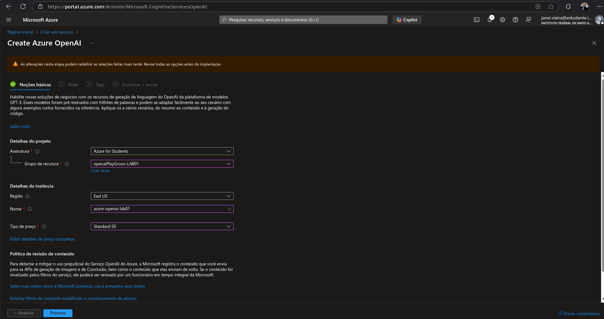
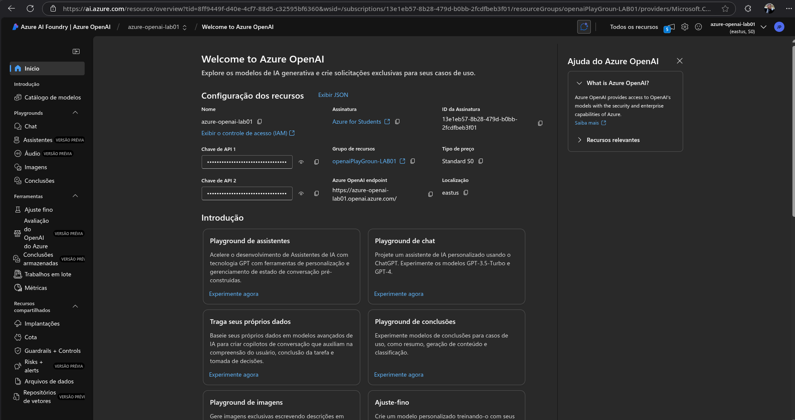
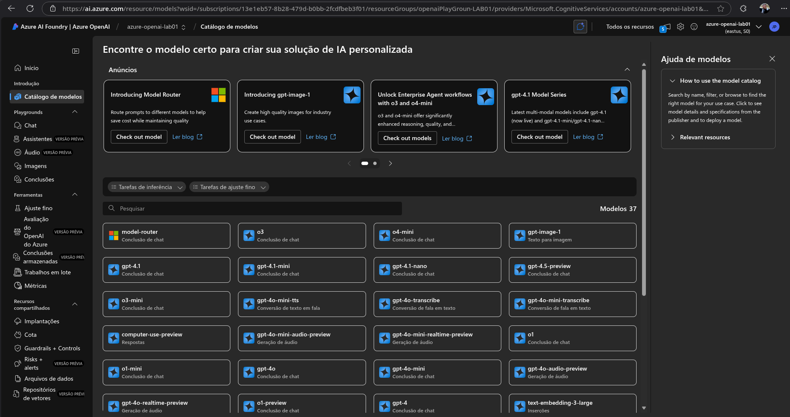
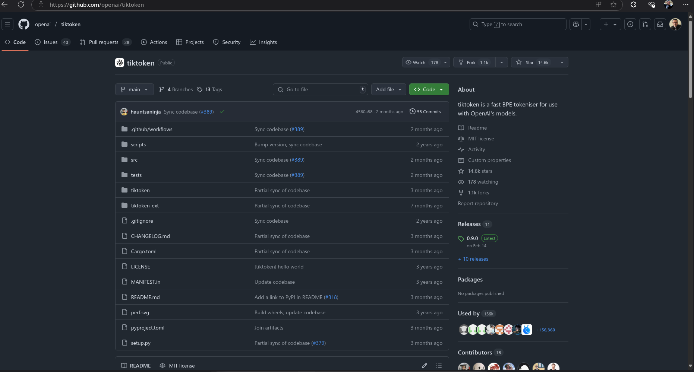
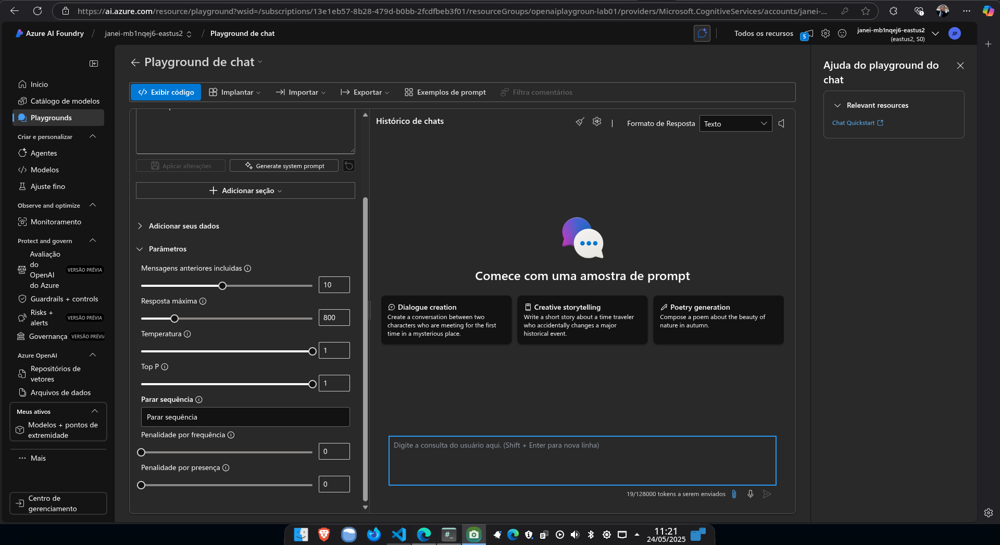
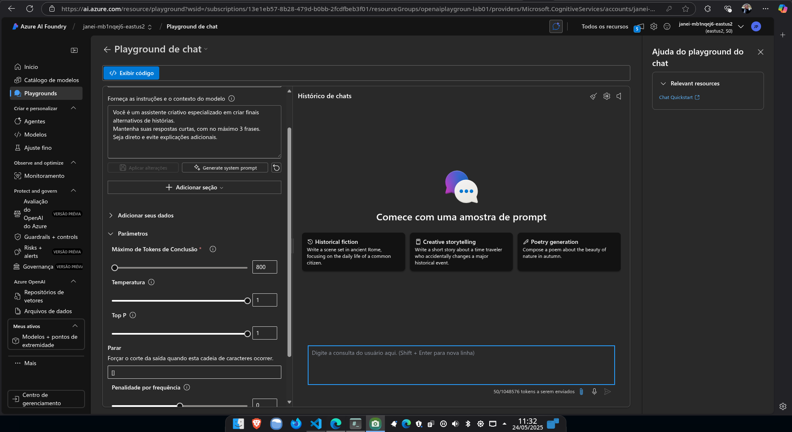
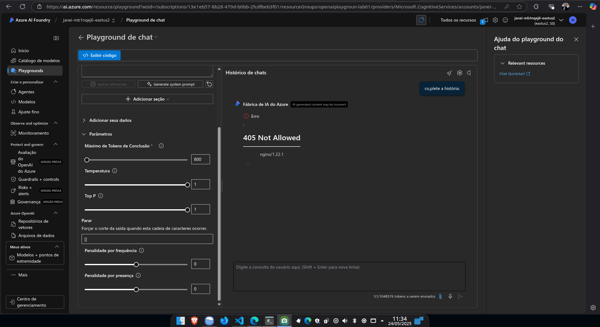
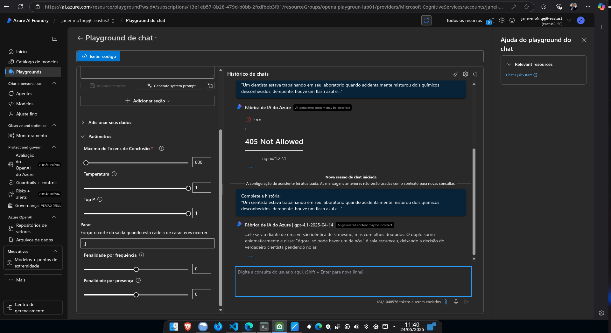
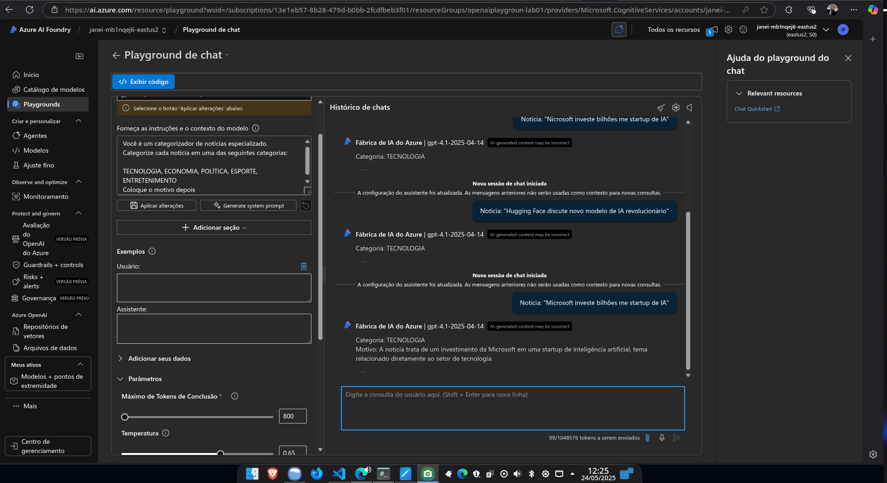

# 🧠 Explorando Azure OpenAI: Primeiras Experiências com Modelos GPT

Durante os testes com a criação e uso da instância **Azure OpenAI**, explorei várias funcionalidades importantes da plataforma, desde a implantação até ajustes de comportamento do modelo. Abaixo, compartilho um resumo dessa jornada.

---

## ☁️ Etapa 1 – Criando a Instância do Azure OpenAI

No portal do Azure, criei uma instância do serviço **Azure OpenAI** a partir da galeria de recursos. O processo é semelhante à criação de outros serviços no Azure.

---

## 🧪 Etapa 2 – Explorando a Foundry

Após a criação, acessei a seção **Foundry**, onde é possível visualizar os modelos disponíveis e seus detalhes. A interface é intuitiva e permite entender rapidamente o que cada modelo oferece.

---

## 📊 Etapa 3 – Visualizando os Modelos Disponíveis

A Foundry apresenta diversos modelos, incluindo variantes da série GPT, com informações sobre versão, desempenho e uso recomendado. Nesse momento, me chamou atenção a presença do **GPT-4.1**.

---

## ✅ Etapa 4 – Conclusões sobre o Modelo GPT-4.1 Implantado

Ao analisar os detalhes do modelo implantado, verifiquei que o **GPT-4.1** estava disponível para uso imediato com suporte a personalização de parâmetros.

---

## 🔡 Etapa 5 – Tokenização com tiktoken

A tokenização é um aspecto importante ao trabalhar com modelos de linguagem. A ferramenta `tiktoken` foi essencial para visualizar como o texto seria convertido em tokens.

---

## 🎛️ Etapa 6 – Testando Parâmetros no Playground

No playground do Azure OpenAI, realizei testes alterando parâmetros como temperatura, top_p e frequência de penalização, observando como isso impactava nas respostas do modelo.

---

## 🧩 Etapa 7 – Personalizando Instruções e Contexto

Foi possível personalizar o comportamento do modelo com instruções específicas e exemplos de contexto, o que direcionou melhor as respostas para minha necessidade.

---

## 🐞 Etapa 8 – Lidando com um Bug no Playground

Durante os testes, encontrei um pequeno bug de exibição na interface do playground, que não afetou a funcionalidade mas vale o registro.

---

## 💬 Etapa 9 – Resposta Gerada pelo Modelo

Com os parâmetros ajustados, obtive uma resposta clara e coerente do modelo. Esse momento confirmou o potencial da ferramenta para aplicações reais.

---

## 🧠 Etapa 10 – Resposta Personalizada

Após personalizar ainda mais o prompt e o sistema de contexto, o modelo respondeu com maior alinhamento à expectativa.

---

## 🖼️ Outras imagens capturadas durante o processo.

Criação da instância do serviço Azure OpenAI no portal.

Interface inicial da Foundry após criar a instância.
 

Tela mostrando modelos como GPT-4 e GPT-4 Turbo.

Conclusão da criação e liberação de uso do GPT-4.1.

  
Exemplo de análise de tokenização com a biblioteca `tiktoken`.

Tela de ajuste de parâmetros como temperatura e frequência.

Personalização de instruções e contexto no prompt.

Bug apresentado no uso do Playground com prompts extensos.

Resposta sem personalização.

Resposta com instruções customizadas.

---

## 📌 Conclusão

Essa exploração com o Azure OpenAI demonstrou como a plataforma é robusta, flexível e bem integrada ao ecossistema da Microsoft. O Playground é uma excelente ferramenta para validar ideias e protótipos antes de integrar os modelos em sistemas mais complexos.

Ainda que tenha notado alguns bugs, a documentação e a interface gráfica facilitam muito o uso. Para usos mais avançados, recomendo explorar as APIs diretamente, integrar via SDKs ou configurar pipelines em ambiente de produção.
